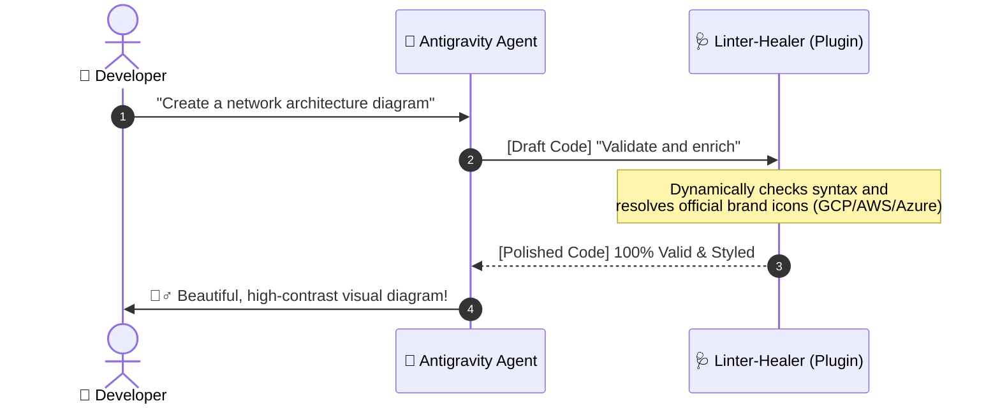
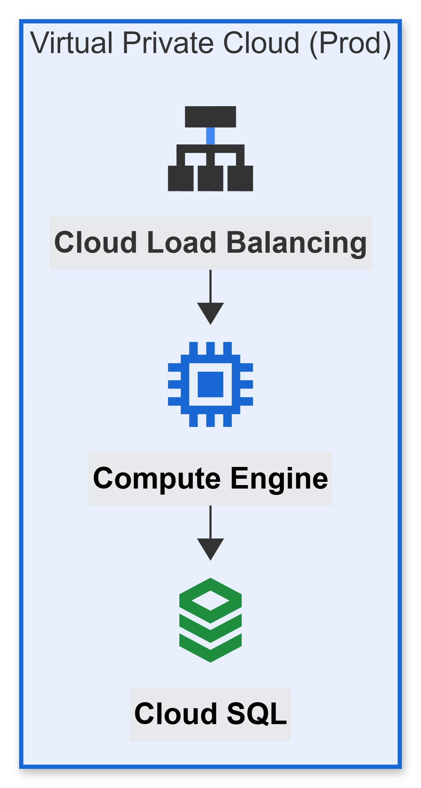

# 🧜‍♂️ jk-agy-mermaid

[](https://github.com/JuanKRuiz/jk-agy-mermaid)
[](LICENSE)
[](https://antigravity.google)

> 🎨 **The ultimate industrial-grade Mermaid.js designer, auditor, and hot-patcher for agentic AI workflows.**

**jk-agy-mermaid** is an autonomous, high-performance plugin built for the **Google Antigravity** agentic ecosystem. It equips AI agents with expert, production-grade capabilities to **design, structure, audit, and auto-heal** complex Mermaid diagrams (including flowcharts, sequence diagrams, and cloud architectures).

---

## 🌟 What makes it special?

Are you tired of AI agents generating broken Mermaid code, using default ugly yellow subgraphs, or ruining brand gradients? 



### ✨ Key Features
*   🩺 **Syntactic Auto-Healing:** No more broken parsers. It dynamically fixes unescaped parentheses, balances quotes, and removes trailing semicolons.
*   ⚡ **Ultra-Fast Icon Search:** Driven by a pre-populated **SQLite3 central cache**, resolving multiple service icons in a single agent turn (GCP, AWS, Azure, SVG Logos, and Font Awesome).
*   🎨 **Brand-First Aesthetics:** Automatic application of official, high-contrast corporate palettes (GCP-First, custom Waypoints, elegant neutral bounds) while strictly protecting original SVG vectors through the **Zero-Style** rule.
*   🧠 **Self-Adaptive Learning Loop:** A closed-feedback loop that registers visualization bugs, updates exclusion blacklists, and patches diagrams on the fly in milliseconds.

---

## 📁 Repository Structure

```text
jk-agy-mermaid/
├── README.md                   # You are here! (User-friendly guide)
├── docs/
│   └── architecture_and_operations.md  # Deep technical dive & system blueprints
├── plugin.json                 # Metadata descriptor & skills catalog
├── agents/                     # Specialized system prompts
│   ├── mermaid-auditor.md      # Esthetic auditor
│   ├── mermaid-linter-fixer.md # Syntactic healer
│   └── mermaid-learner.md      # Immune learning loop
├── rules/                      # System-wide operational guidelines
└── skills/
    └── mermaid-designer/       # Core workflows, icon databases & Python engines
```

---

## 🚀 Quick Start

### 1. Installation
To install this plugin in your local **Google Antigravity** environment, simply clone or place the folder inside your active workspace and list it in your configuration:

```bash
git clone https://github.com/JuanKRuiz/jk-agy-mermaid.git
```

### 2. Finding Icons via Command Line
The plugin features a lightning-fast Python CLI search tool. You can search for brand icons in batch in milliseconds:

```bash
# Query multiple service concepts in a single execution
python3 skills/mermaid-designer/scripts/query_icons.py --batch "load balancer" "entra id" "gcp:vertexai" "database"
```

### 3. Example Prompt for your Agent
Once installed, your Antigravity agent becomes a Master Designer. You can interact with it in Spanglish or Spanish, and it will output standard English diagrams:

> *"Diséñame un diagrama TD con subgrafos que muestre un cliente móvil conectándose a través de un Load Balancer a un App Engine y finalmente guardando datos en BigQuery. Asegúrate de usar los iconos oficiales y seguir la paleta GCP-First."*

---

## 📐 Styling Previews (Google Cloud Palette)

All diagrams generated by the plugin are built with a beautiful white canvas structure and premium high-contrast pastel variables:

```text
---
config:
  layout: elk
  look: neo
  theme: default
themeVariables:
  fontFamily: 'Roboto, Google Sans, Helvetica, Arial, sans-serif'
  primaryColor: '#4285F4'
  secondaryColor: '#34A853'
  mainBkg: '#FFFFFF'
  nodeBorder: '#4285F4'
  clusterBkg: '#F8F9FA'
  clusterBorder: '#DADCE0'
  lineColor: '#5F6368'
  edgeLabelBackground: '#ffffff'
---
flowchart TD
    subgraph VPC ["Virtual Private Cloud (Prod)"]
        direction TB
        LB["`**Cloud Load Balancing**`"]
        LB@{ icon: "gcp:cloud-load-balancing" }
        
        App["`**Compute Engine**`"]:::gcpBlue
        App@{ icon: "gcp:compute-engine" }
        
        DB["`**Cloud SQL**`"]:::gcpGreen
        DB@{ icon: "gcp:cloud-sql" }
        
        LB --> App
        App --> DB
    end
    
    style VPC fill:#e8f0fe,stroke:#1967D2,stroke-width:2px
    classDef gcpBlue fill:#E8F0FE,stroke:#1967D2,stroke-width:2px,color:#000
    classDef gcpGreen fill:#E6F4EA,stroke:#1E8E3E,stroke-width:2px,color:#000
```

💡 *Note: Because GitHub's native Markdown viewer does not support custom icon loading (`@{ icon: "..." }`), here is how the diagram renders inside an Antigravity or standard Mermaid-supported editor/viewer:*



---

## 📖 Deep Technical Dive

For a detailed walkthrough of the internal mechanics, agent matrix roles, linting regular expressions, and SQLite indexing schema, please refer to the:

👉 **[Architecture & Operations Guide](docs/architecture_and_operations.md)**

---

## 🤝 Contribution & License

This project is open-source and released under the **MIT License**. Contributions, bug reports, and suggestions for new cloud brand icons are highly welcome! 

*Developed with passion for the Antigravity community by JuanK Ruiz.*
