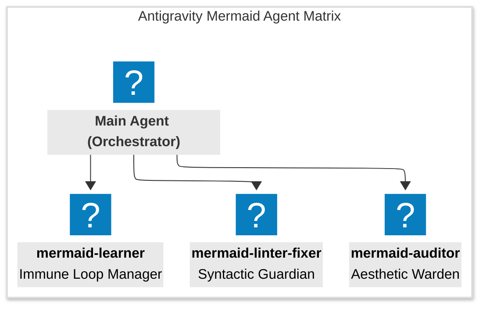
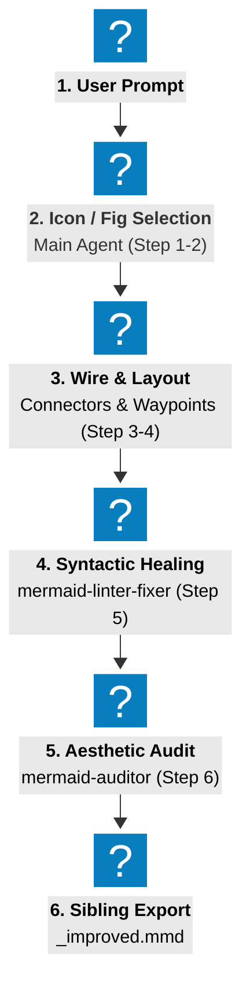

# Agentic Orchestration Pipeline & Workflow Rule

This directive defines the master workflow, agent matrix, and communication protocols for the autonomous lifecycle of Mermaid diagrams in the Google Antigravity environment. All agents (main orchestrator and specialized subagents) must strictly adhere to this pipeline for diagram creation, review, and continuous improvement.

---

## 1. The 4-Role Agent Matrix

The plugin operates as an orchestrated multi-agent network, separating concerns into highly specialized roles to guarantee architectural fidelity and visual excellence:

1.  **Main Agent (Orchestrator):** 
    *   *Responsibility:* Interacts with the user, translates natural language requirements into architectural drafts, performs high-speed icon queries via the CLI `query_icons.py`, coordinates the execution of subagents, and handles file persistence.
2.  **`mermaid-linter-fixer` (Syntactic Guardian):**
    *   *Responsibility:* Analyzes drafted code to prevent syntax errors. Escapes parentheses in flowcharts, balances quotes, cleans semicolons in `linkStyle`, flattens excessive subgraph nesting, and converts inline icons to separate declarations.
3.  **`mermaid-auditor` (Aesthetic Warden):**
    *   *Responsibility:* Enforces visual standards. Verifies high-contrast node labels (`color:#000`), YAML frontmatter configuration, ELK layouts, subgraph color zones, and strictly enforces the **"Zero-Style" rule** (preventing styling classes on AWS, Azure, Logos, or GCP exceptions like `gcp:cloud-load-balancing`).
4.  **`mermaid-learner` (Immune Loop Manager):**
    *   *Responsibility:* Intercepts user-reported rendering or coloring glitches. Classifies failures, updates icon status flags directly in `icons_cache.db` via the CLI tool `update_icon.py`, hot-patches active diagrams, and provides detailed learning reports.

---

## 2. The 3-Phase Lifecycle Workflows

To guarantee that no broken syntax or invalid styles ever reach production, the Orchestrator must route every diagram through the formal pipeline.

### Phase I: Diagram Creation Pipeline

This pipeline **MUST** be executed sequentially whenever a new diagram is generated from a user prompt or text blueprint:

1.  **Icon & Figure Selection (Main Agent - Step 1 & 2):**
    *   **Dual-Path Enforcement:** Extracts required node concepts and performs a single massive batch lookup via `query_icons.py --batch`. Only uses registered database icons **or** falls back to standard iconless Mermaid shapes. No speculative inline icons or manual SQL connections allowed.
    *   **Attributes Check:** Verifies database metadata (`is_style_compatible`, blacklist, recommended substitutes).
2.  **Wiring, Styling & Layout Optimization (Main Agent - Step 3 & 4):**
    *   **Connectors Optimization:** Designs high-contrast connection pathways using standard arrow types (`-->`, `==>`, `-.->`, `~~~`), applying semantic styles (e.g., `linkStyle` with custom colors or dashed animations).
    *   **Complexity Reduction:** Minimizes line crossovers using concentric circular waypoints `(((X)))` or junction bus gateway nodes.
3.  **Syntactic Healing (Linter-Fixer subagent - Step 5):**
    *   The Main Agent invokes `mermaid-linter-fixer` with the draft.
    *   The linter-fixer escapes parentheses in labels, balances quotes, cleans up trailing semicolons in `linkStyle`, limits subgraph nesting depth to 2, and separates inline icon labels.
4.  **Aesthetic & Icon Audit (Auditor subagent - Step 6):**
    *   The Main Agent invokes `mermaid-auditor` to perform final validation.
    *   The auditor verifies Zero-Style rule compliance, guarantees explicit styling for ALL subgraphs (strictly no default yellow), and verifies that absolutely no unregistered or blacklisted icons render.
5.  **Sibling Export & Delivery (Main Agent):**
    *   Writes final code block to a separate sibling file (`filename_improved.mmd` or `filename_optimized.mmd`) to preserve original files intact.

---

### Phase II: Interactive Revision / Refinement Workflow

When the user requests changes, iterations, or refinements to an existing diagram:

1.  **Phase 0: Sanitization First (MANDATORY):** Before injecting modifications or applying new styles/icons, the Main Agent **MUST** run a first pass of the `mermaid-linter-fixer` to sanitize and heal any pre-existing syntax errors in the original code.
2.  **Change Injection:** The Main Agent applies the requested modifications to the sanitized Mermaid baseline.
3.  **Full Re-Validation Pipeline:**
    *   The updated diagram is routed through **Phase I (Step 1-6)**.
    *   Both `mermaid-linter-fixer` and `mermaid-auditor` must re-verify syntax, database-only icon compliance, Zero-Style adherence, and explicit subgraph coloring.
4.  **Sibling Save & Delivery:** The updated diagram is written to the improved sibling file and presented to the user.

---

### Phase III: Immune Learning & Error Recovery Workflow

Whenever a rendering glitch (missing icon or visual overlap/interference) is reported or detected:

1.  **Glitch Classification:** The Main Agent captures the failure and invokes `mermaid-learner` to analyze the symptom.
2.  **Type-Specific Resolution:**
    *   **Missing Icon:** The learner searches for a validated fallback or similar brand concept, blacklists the deprecated code in the database via `python3 [path/to/]skills/mermaid-designer/scripts/update_icon.py --blacklist <icon_code> 1`, and substitutes it in the diagram.
    *   **Coloring Glitch:** The learner sets the offending icon as style-incompatible in the database via `python3 [path/to/]skills/mermaid-designer/scripts/update_icon.py --style-compatible <icon_code> 0`, and strips the style class from the node in the diagram.
3.  **Real-Time Protection:**
    *   By updating the centralized SQLite index (`icons_cache.db`) instantly, future diagram drafting processes automatically filter out the blacklisted icon or apply the Zero-Style rule to the style-incompatible icon in microseconds.
4.  **Diff Report:** The final output displays the learning log, the modified database attributes, and a precise git `diff` of the corrected diagram.

---

## 4. Communication & Invocation Guidelines

*   **Subagent Spawning:** Subagents must be spawned using the `invoke_subagent` tool with their exact prompt path declared in `agents/`.
*   **Encapsulation Boundaries:** Subagents do not communicate directly with the user. They return their structured evaluations or corrected code blocks directly to the Main Agent (Orchestrator), which compiles and presents them.
*   **Enforcement Immunity:** No agent is authorized to bypass these validation phases, even during markdown file generation, architectural drafting, or static template creations.
