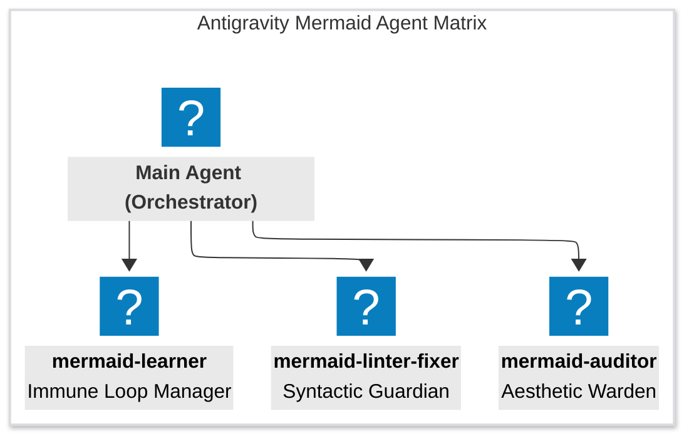
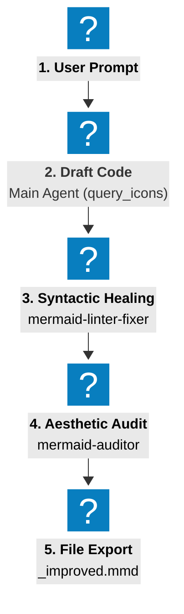

# Agentic Orchestration Pipeline & Workflow Rule

This directive defines the master workflow, agent matrix, and communication protocols for the autonomous lifecycle of Mermaid diagrams in the Google Antigravity environment. All agents (main orchestrator and specialized subagents) must strictly adhere to this pipeline for diagram creation, review, and continuous improvement.

---

## 1. The 4-Role Agent Matrix

The plugin operates as an orchestrated multi-agent network, separating concerns into highly specialized roles to guarantee architectural fidelity and visual excellence:

1.  **Main Agent (Orchestrator):** 
    *   *Responsibility:* Interacts with the user, translates natural language requirements into architectural drafts, performs high-speed icon queries via the CLI `query_icons.py`, coordinates the execution of subagents, and handles file persistence.
2.  **`mermaid-linter-fixer` (Syntactic Guardian):**
    *   *Responsibility:* Analyzes drafted code to prevent syntax errors. Escapes parentheses in flowcharts, balances quotes, cleans semicolons in `linkStyle`, flattens excessive subgraph nesting, and converts inline icons to separate declarations.
3.  **`mermaid-auditor` (Aesthetic Warden):**
    *   *Responsibility:* Enforces visual standards. Verifies high-contrast node labels (`color:#000`), YAML frontmatter configuration, ELK layouts, subgraph color zones, and strictly enforces the **"Zero-Style" rule** (preventing styling classes on AWS, Azure, Logos, or GCP exceptions like `gcp:cloud-load-balancing`).
4.  **`mermaid-learner` (Immune Loop Manager):**
    *   *Responsibility:* Intercepts user-reported rendering or coloring glitches. Classifies failures, updates icon status flags directly in `icons_cache.db` via the CLI tool `update_icon.py`, hot-patches active diagrams, and provides detailed learning reports.

---

## 2. The 3-Phase Lifecycle Workflows

To guarantee that no broken syntax or invalid styles ever reach production, the Orchestrator must route every diagram through the formal pipeline.

### Phase I: Diagram Creation Pipeline

This pipeline **MUST** be executed sequentially whenever a new diagram is generated from a user prompt or text blueprint:

1.  **Drafting (Main Agent):**
    *   Analyzes the requirements and performs a single massive batch lookup of brand icons via the SQLite CLI search engine:
        `python3 [path/to/]skills/mermaid-designer/scripts/query_icons.py --batch "term 1" "term 2" ...`
    *   Constructs the initial draft incorporating ELK layout configuration, YAML frontmatter, subgraphs, and node connections.
2.  **Syntactic Healing (Linter-Fixer subagent):**
    *   The Main Agent invokes `mermaid-linter-fixer` with the draft.
    *   The linter-fixer audits the syntax, escapes parentheses, matches quotes, corrects semicolons, and enforces the maximum nesting limit of 2.
    *   *Output:* A syntactically robust Mermaid draft.
3.  **Aesthetic Audit (Auditor subagent):**
    *   The Main Agent invokes `mermaid-auditor` with the syntactically healed draft.
    *   The auditor checks that **every** subgraph has an explicit styling override (no default yellow), and verifies that icons marked with `is_style_compatible = 0` (AWS, Azure, Logos, or GCP gradients) have **zero style classes applied** (Zero-Style rule).
    *   *Output:* A visually pristine, high-contrast, brand-compliant diagram code block.
4.  **Sibling Export & Delivery (Main Agent):**
    *   Saves the finalized code into a separate file using the **Sibling Creation Policy** (`filename_improved.mmd` or `filename_optimized.mmd`) to preserve original files.
    *   Presents the code, visual preview, and explanation to the user.

---

### Phase II: Interactive Revision / Refinement Workflow

When the user requests changes, iterations, or refinements to an existing diagram:

1.  **Change Injection:** The Main Agent reads the current diagram and injects the requested modifications into the Mermaid structure.
2.  **Re-Validation Pipeline:**
    *   The draft is automatically routed back through **Phase I (Step 2: Syntactic Healing)** and **Phase I (Step 3: Aesthetic Audit)**.
    *   Specialized agents must verify that the user's requested edits have not introduced bracket imbalance, unescaped text, or styling overrides on "Zero-Style" brand icons.
3.  **Delivery:** The updated code is saved to the improved sibling file and presented.

---

### Phase III: Immune Learning & Error Recovery Workflow

Whenever a rendering glitch (missing icon or visual overlap/interference) is reported or detected:

1.  **Glitch Classification:** The Main Agent captures the failure and invokes `mermaid-learner` to analyze the symptom.
2.  **Type-Specific Resolution:**
    *   **Missing Icon:** The learner searches for a validated fallback or similar brand concept, blacklists the deprecated code in the database via `python3 [path/to/]skills/mermaid-designer/scripts/update_icon.py --blacklist <icon_code> 1`, and substitutes it in the diagram.
    *   **Coloring Glitch:** The learner sets the offending icon as style-incompatible in the database via `python3 [path/to/]skills/mermaid-designer/scripts/update_icon.py --style-compatible <icon_code> 0`, and strips the style class from the node in the diagram.
3.  **Real-Time Protection:**
    *   By updating the centralized SQLite index (`icons_cache.db`) instantly, future diagram drafting processes automatically filter out the blacklisted icon or apply the Zero-Style rule to the style-incompatible icon in microseconds.
4.  **Diff Report:** The final output displays the learning log, the modified database attributes, and a precise git `diff` of the corrected diagram.

---

## 4. Communication & Invocation Guidelines

*   **Subagent Spawning:** Subagents must be spawned using the `invoke_subagent` tool with their exact prompt path declared in `agents/`.
*   **Encapsulation Boundaries:** Subagents do not communicate directly with the user. They return their structured evaluations or corrected code blocks directly to the Main Agent (Orchestrator), which compiles and presents them.
*   **Enforcement Immunity:** No agent is authorized to bypass these validation phases, even during markdown file generation, architectural drafting, or static template creations.
