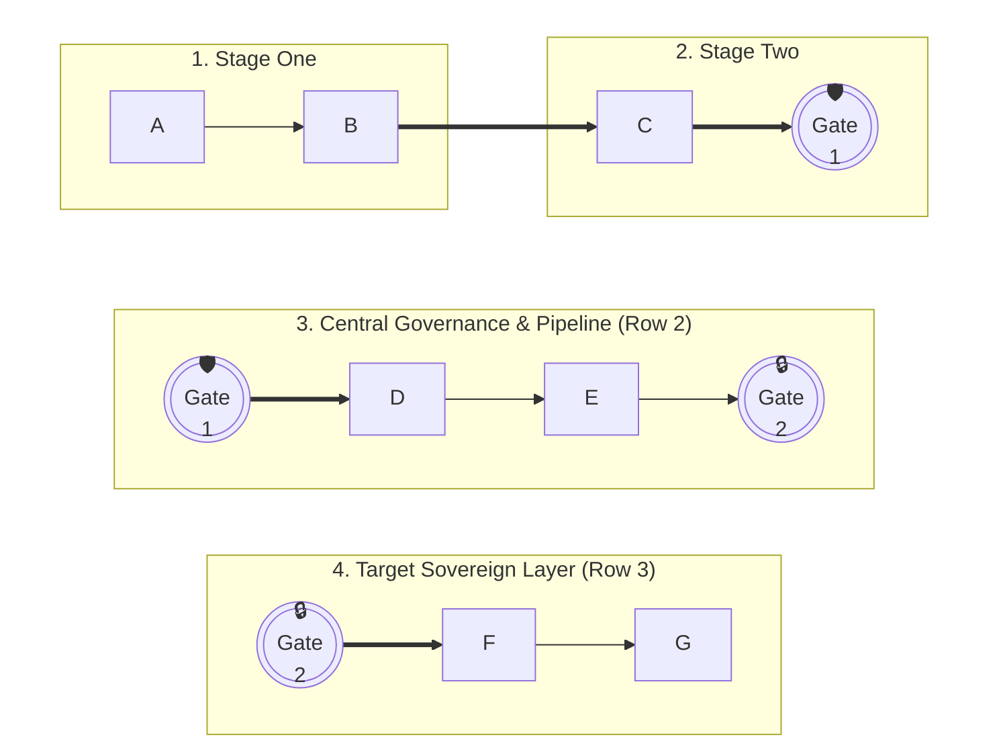

# Professional Mermaid Diagram Style & Presentation Rule

This directive establishes the mandatory aesthetic, contrast, and colorization standards for all diagrams in the workspace. Any agent or script that generates or edits Mermaid code must strictly adhere to these specifications.

---

## 1. Brand Color Palette & Contrast Formulas

To guarantee industrial readability of nodes, custom style classes with pastel backgrounds and high-saturation solid borders must be used. The font color **MUST** always be forced to pure black (`color:#000`) or pure white (`color:#fff`) to override browser gray inheritance.

```mermaid
%% Standard Design Class Declarations
classDef gcpBlue fill:#E8F0FE,stroke:#1967D2,stroke-width:2px,color:#000,font-family:Roboto;
classDef gcpGreen fill:#E6F4EA,stroke:#1E8E3E,stroke-width:2px,color:#000,font-family:Roboto;
classDef gcpYellow fill:#FEF7E0,stroke:#B06000,stroke-width:2px,color:#000,font-family:Roboto;
classDef gcpRed fill:#FCE8E6,stroke:#D93025,stroke-width:2px,color:#000,font-family:Roboto;
classDef neutral fill:#F1F3F4,stroke:#5F6368,stroke-width:2px,color:#000,font-family:Roboto;
```

*   **GCP Blue (Web, General Traffic, API, Compute):** `fill:#E8F0FE,stroke:#1967D2,stroke-width:2px,color:#000`
*   **GCP Green (Private Network, VPN, Security, Secure Databases):** `fill:#E6F4EA,stroke:#1E8E3E,stroke-width:2px,color:#000`
*   **GCP Yellow (Authentication, IAM, Third-party, External Providers):** `fill:#FEF7E0,stroke:#B06000,stroke-width:2px,color:#000`
*   **GCP Red (Failure, Alert, Block, Critical Return):** `fill:#FCE8E6,stroke:#D93025,stroke-width:2px,color:#000`
*   **Neutral (Secondary, Redundant, or Support Elements):** `fill:#F1F3F4,stroke:#5F6368,stroke-width:2px,color:#000`

---

## 2. Mandatory Header Configuration (YAML Frontmatter) & Cloudtop-Side Rendering Standard

[!CRITICAL][!NON-NEGOTIABLE]
Every Mermaid diagram generated or edited in `.mmd` files **MUST** include the complete **YAML Frontmatter** header (`---` ... `---`) with `layout: elk` and `look: neo`. This configuration is the **Enterprise Gold Standard** for visual quality.

### 2.1. Maximum Support Architecture: Cloudtop-Side Rendering & Auto-Padding (Recommended Default)
To achieve 100% support for **ELK layout (`layout: elk`)**, **Neo look**, **custom `themeVariables`**, **Iconify vector icons**, and all diagram types (including `gantt` and `mindmap`), **DO NOT use Jetski's built-in Markdown parser as a Mermaid viewer**. Instead:
1. **Write the complete `.mmd` file** with full YAML Frontmatter (`---` ... `---`).
2. **Render and calibrate server-side on Cloudtop** into a 3x HiDPI PNG auto-padded for document/slide aspect ratio ($\frac{H}{W} \le 1.15$) using the plugin's self-contained pipeline:
   ```bash
   python3 ~/.gemini/config/plugins/jk-agy-mermaid/skills/mermaid-designer/scripts/render_pipeline.py <diagram.mmd>
   ```
   Or direct headless Node renderer:
   ```bash
   node ~/.gemini/config/plugins/jk-agy-mermaid/skills/mermaid-designer/scripts/render_native.js <diagram.mmd> [output.png]
   ```
3. **Display the pre-rendered graphic in Jetski** by copying `<basename>_padded.png` to `<appDataDir>/brain/<conversation-id>/` and embedding it via ``.

```yaml
---
config:
  layout: elk
  look: neo
  theme: default
themeVariables:
  fontFamily: 'Roboto, Google Sans, Helvetica, Arial, sans-serif'
  primaryColor: '#4285F4'
  secondaryColor: '#34A853'
  tertiaryColor: '#FBBC04'
  mainBkg: '#FFFFFF'
  nodeBorder: '#4285F4'
  clusterBkg: '#F8F9FA'
  clusterBorder: '#DADCE0'
  lineColor: '#5F6368'
  edgeLabelBackground: '#ffffff'
---
```

### 2.2. Conditional Matrix: Jetski Native Inline Viewer vs. Cloudtop-Side Pre-Rendering
The built-in Jetski Chat UI viewer only supports a limited subset of Mermaid syntax natively:
*   **Natively Supported Diagram Types in Jetski Inline Viewer**: `flowchart`/`graph`, `stateDiagram-v2`, `sequenceDiagram`, `classDiagram`, `erDiagram`, `xychart-beta`.
*   **Natively UNSUPPORTED in Jetski Inline Viewer**: YAML Frontmatter (`---`), `%%{init:...}%%`, ELK layout engine, offline Iconify vector icons, `gantt`, and `mindmap`.
*   **Rule for Inline ` ```mermaid ` Code Blocks**: If (and only if) you output raw Mermaid code directly inside a Chat UI ` ```mermaid ` block for quick inline preview, you must omit the `---` YAML frontmatter block so line 1 starts directly with the supported diagram keyword (`flowchart TD`, `sequenceDiagram`, etc.). For maximum visual fidelity, always prefer Cloudtop-side pre-rendering.

---

## 3. "Zero-Style" Rule for AWS, Azure, Logos, and Excluded GCP (Icons as Brands)

It is **strictly forbidden** to apply style classes that define background color (`fill`) or border (`stroke`) to nodes representing brands or using vector icons of:
1.  **AWS** (`aws:*`)
2.  **Azure** (`azure:*`)
3.  **Logos** (`logos:*`, e.g., `logos:google-gemini`, `logos:salesforce`, `logos:mongodb`, `logos:kubernetes`)
4.  **GCP Exceptions** with complex vector gradients and 3D shadows (such as `gcp:cloud-load-balancing`, `gcp:private-service-connect`, and `gcp:advanced-agent-modeling`).

**Justification:** These icons are **registered trademarks** and have complex pre-defined internal vector structures and chromatic identities. Injecting a CSS class with background (`fill`) or border (`stroke`) overrides and interferes with the SVG path rendering, "flattening" the image into a solid opaque block (black, blue, or gray) and ruining the visualization.

**Implementation Standard:**
*   The safest and recommended way is **NOT to apply any class suffix** (e.g., `:::class`) to these nodes. The node will inherit a transparent neutral background and display the logo perfectly.
*   *Correct:*
    ```mermaid
    AppGemini["`**Gemini Enterprise**<br>Web App`"]
    AppGemini@{ icon: "logos:google-gemini" }
    ```
*   *Incorrect (Prohibited style filling on brands):*
    ```mermaid
    AppGemini["`**Gemini Enterprise**<br>Web App`"]:::gcpYellow
    AppGemini@{ icon: "logos:google-gemini" }
    ```
*   If exceptionally a typography, size, or thickness style is required, use a class free of `fill` and `stroke` properties:
    ```mermaid
    classDef neutralZeroStyle color:#000,stroke-width:2px,font-family:Roboto;
    ```

---

## 4. Visual Waypoint (Teleporter) Design & Color Palette

Visual teleportation waypoints are **off-page connectors (teleporter ports)** designed to decouple dense clusters, separate architectural tiers (e.g. strategic upper tier vs. execution lower tier), and eliminate spaghetti cross-cluster connection lines.

### 4.1. Golden Rule of Decoupling (ZERO Physical Cross-Cluster Edges)
[!CRITICAL][!NON-NEGOTIABLE]
*   **The Teleportation Principle:** A waypoint is an isolated off-page port, NOT an intermediate circle connected by lines.
*   **STRICT PROHIBITION:** It is **STRONGLY FORBIDDEN** to draw a line, arrow, or connector between the source waypoint and destination waypoint (e.g., `wpA_src ==> wpA_dst` or `wpA_src --> wpA_dst` is **STRICTLY PROHIBITED**).
*   **Why?** Drawing an edge between waypoints completely defeats the waypoint architecture, re-introduces cross-cluster compound edges between subgraphs, and forces Dagre/ELK to stretch ranks vertically with massive white space and visual distortion.
*   **The Canonical Teleportation Pattern:**
    ```mermaid
    %% Upper Cluster: Point to exit port
    source_node --> wpA_src(((A))):::wp_blue

    %% Lower Cluster: Start from entry port (ZERO connection between wpA_src and wpA_dst!)
    wpA_dst(((A))):::wp_blue --> dest_node
    ```
    *Notice that each cluster is solved independently by the layout engine, resulting in balanced, compact, and rectilinear diagrams.*

### 4.2. Waypoint Diameter Optimization via Multi-Line Tokenization
[!CRITICAL]
*   **The Diameter Inflation Issue:** In Mermaid circular nodes `(((label)))`, circle diameter is calculated based on the widest single horizontal line of text. Placing text on a single line (e.g., `((("🛰️ Store Gate")))`) blows up the node into a huge balloon with vast dead space.
*   **Mandatory Multi-Line Formatting:** Always split waypoint labels across multiple lines using `<br>` with a maximum of 1 short word per line (or single letters/numbers):
    *   *Short Token:* `wpA_src(((A))):::wp_blue`
    *   *Descriptive Token:* `wpStore_src((("🛰️<br>Store<br>Gate"))):::wp_green`

### 4.3. Mandatory Color Palette for Waypoints
Waypoints must look consistent, high-contrast, and bold:
*   **Web / API / Strategic Mandate (GCP Blue):**
    `classDef wp_blue fill:#1A73E8,stroke:#0D47A1,stroke-width:2px,color:#fff,font-weight:bold;`
*   **Security / Governance / Guardrails (GCP Green):**
    `classDef wp_green fill:#34A853,stroke:#1B5E20,stroke-width:2px,color:#fff,font-weight:bold;`
*   **Authentication / Delivery / Packaging (GCP Yellow):**
    `classDef wp_yellow fill:#FBBC04,stroke:#F29900,stroke-width:2px,color:#000,font-weight:bold;`
*   **Alert / PRR Gate / Escalation (GCP Red):**
    `classDef wp_red fill:#EA4335,stroke:#C5221F,stroke-width:2px,color:#fff,font-weight:bold;`
*   **Data Layer / Persistence / Dark Tier (AWS Dark):**
    `classDef wp_dark fill:#232F3E,stroke:#000,stroke-width:2px,color:#fff,font-weight:bold;`

---

## 5. Mandatory Native Syntax for Icons (Prohibition of Inline Icons)

To guarantee that icons render with maximum fidelity and do not break node geometries, the following mandatory syntactic rule is established:

1.  **STRICT PROHIBITION OF INLINE ICONS IN LABELS:**
    *   It is **totally forbidden** to inject icon codes (such as `fa:`, `gcp:`, `azure:`, `logos:`) inside the node text or label (e.g., `node["fa:circle-user <br> Label"]` or `node["`azure:mobile` <br> **Label**"]`).
    *   *Reason:* Inline icon labels cause severe visual alignment failures, distort the text box, and are incompatible with modern Mermaid layout engines.

2.  **MANDATORY SEPARATE DECLARATION SYNTAX:**
    *   All icons must be declared autonomously and independently on the line immediately subsequent to the node definition, using the syntax:
        ```mermaid
        id["`**Node Label**`"]:::styleClass
        id@{ icon: "category:icon-name" }
        ```
    *   *Correct Example:*
        ```mermaid
        FinalUser["`**First Line User**`"]:::gcpBlue
        FinalUser@{ icon: "fa:user" }
        ```
    *   *Incorrect Example (FORBIDDEN):*
        ```mermaid
        FinalUser["`fa:circle-user` <br> **First Line User**"]
        ```

---

## 6. Prohibition of Default Subgraph Yellow Backgrounds & Zone Semantics

Subgraph colorization is not a decorative element; it represents the operational and security nature of the infrastructure outlined in the blueprint.

*   **STRICT PROHIBITION (NO DEFAULT YELLOW):** It is **strictly forbidden** for a subgraph to adopt Mermaid's default background yellow color (`#FBBC04` / `#fef7e0`). If a subgraph renders in default yellow, it is a **severe design error** that violates corporate standards. All subgraphs must have explicit styles applied according to their semantics.
*   **OBLIGATION TO DECLARE EXPLICIT STYLE (MANDATORY SYNTAX):**
    To override Mermaid's default yellow background, **you must add** a `style <SubgraphId>` styling directive at the end of the file for each subgraph declared in the diagram. Omitting this directive in any subgraph is not allowed.
*   **ZONE STYLING NARRATIVE SEMANTICS AND SYNTAX EXAMPLES:**
    1.  **Platform Unified (Managed / GCP Cloud):**
        *   *Meaning:* Managed, robust physical or PaaS infrastructure (secure cloud environments).
        *   *Style:* Soft Brand Background (GCP Blue `#e8f0fe` or GCP Green `#e6f4ea`) with saturated solid brand borders.
        *   *GCP Blue Syntax:* `style SUBGRAPH_ID fill:#e8f0fe,stroke:#1967D2,stroke-width:2px`
        *   *GCP Green Syntax (Secure DB / Network):* `style SUBGRAPH_ID fill:#e6f4ea,stroke:#1E8E3E,stroke-width:2px`
    2.  **Logical/External / Zero Trust Zones:**
        *   *Meaning:* Logical access zones, ephemeral perimeters, external providers, or on-premises networks under zero trust.
        *   *Style:* Pure White Background (`#ffffff`) with dashed or dotted gray border.
        *   *Syntax:* `style SUBGRAPH_ID fill:#ffffff,stroke:#9E9E9E,stroke-dasharray:5 5,stroke-width:2px`
    3.  **Neutral or Generic Zones:**
        *   *Meaning:* Generic groupers or secondary infrastructure.
        *   *Style:* Soft light gray (`#f9f9f9`) or Pure White (`#ffffff`) with solid gray border.
        *   *Gray Syntax:* `style SUBGRAPH_ID fill:#f9f9f9,stroke:#DADCE0,stroke-width:2px`
        *   *White Syntax:* `style SUBGRAPH_ID fill:#ffffff,stroke:#DADCE0,stroke-width:2px`
    4.  **Forbidden / Default Yellow:**
        *   *Action:* Any subgraph that ends up with the default yellow background must be re-styled immediately to one of the options above. No subgraph without explicit styling will be tolerated.

---

## 7. Icon Dual-Path Policy, Connector Optimization, and Complexity Reduction (MANDATORY)

To ensure consistency, portability, and reliable rendering within the offline execution limits of the Antigravity system, all diagram designs must adhere to these absolute architectural rules:

### A. Dual-Path Icon Policy
*   **Database-Only Icons:** It is **strictly prohibited** to use any icon (Font Awesome `fa:*`, Cloud `gcp:*`/`aws:*`/`azure:*`, or logo `logos:*`) that does not physically exist in the pre-populated SQLite database index (`icons_cache.db`). Any diagram utilizing an unregistered icon violates compliance and **must be rejected** by the auditor.
*   **Standard Iconless Figures:** When a required concept is not present in the database, you **MUST** use standard, pure Mermaid shapes (rectangles, rounded boxes, cylinders, circles) with **absolutely no icons**. Standard icon-less figures are the official, fully compliant path to represent concepts without database-registered icons.
*   **Verification:** Always run `query_icons.py --batch` to resolve concepts and respect the returned `is_style_compatible`, `is_blacklisted`, and substitute metadata.

### B. Connector Optimization & Custom linkStyle
*   **Standard Arrows:** Wire your diagrams using only the 4 standard flowchart connectors:
    *   `-->` (Standard solid arrow)
    *   `==>` (Thick solid arrow - for primary flows/critical paths)
    *   `-.->` (Dotted arrow - for control or secondary flows)
    *   `~~~` (Invisible line - to force spatial layouts)
*   **Custom linkStyle:** Apply explicit styles to connectors using `linkStyle` (systematically removing the trailing semicolon) to add semantic colors, custom line weights, and animations (e.g., `stroke-dasharray` for customized dash rates). Keep connectors contrasting and clean.

### C. Complexity Reduction with Waypoints & Junction Buses
*   **Waypoints (Teleporters):** If connection arrows traverse multiple subgraphs or cross more than 4 times, replace the long spaghetti arrow with a local circular concentric port at both source and destination (e.g., `wpA(((A))):::wp_blue`). Use matching waypoint style classes (`:::wp_blue`, `:::wp_green`, etc.) to denote the common logical link.
*   **Junction Bus Pattern:** Group parallel connections going to a single subgraph into a single entrance `junction` gateway node inside that subgraph to avoid overlapping lines and clutter.

---

## 8. Document & Mobile Layout Optimization (Stacked Multi-Row Default vs. User Variants)
[!CRITICAL][!NON-NEGOTIABLE]

When generating or rendering Mermaid architectural flowcharts intended to be embedded in **Google Docs (Letter/Legal portrait pages)**, **PDF reports**, **Google Slides**, or viewed on **mobile devices**, extreme aspect ratios ruin legibility:
*   **The Horizontal Trap (`LR`):** Pure left-to-right panoramas (`4000+ px` wide) shrink into microscopic, unreadable strips when scaled down to fit portrait document margins (630pt – 790pt width).
*   **The Vertical Trap (`TD`):** Pure single-column vertical towers (`5000+ px` tall) span across multiple page breaks, losing visual continuity.

### 8.1. Mandatory Default for Documents: Stacked Multi-Row Layout (Balanced Aspect Ratio)
By default, for any document or executive deliverable, you MUST structure multi-stage architectures into **2 to 3 stacked horizontal rows** connected via **Teleporter Waypoints** (`(((Gate)))`) and ordered vertically using invisible links (`~~~`):

1.  **Row 1 (Side-by-Side Context & Runtime):** Group initial stages (e.g., `1. Endpoint Perimeter` and `2. Antigravity Runtime`) inside an invisible wrapper subgraph (`style ROW1 fill:none,stroke:none`) with `direction LR` so they sit side-by-side at the top. Terminate the row at an exit Waypoint (`wpGov_src`).
2.  **Row 2 (Central Control / Governance Pipeline):** Place the core processing or governance pipeline (`3. Admin Console / Security Gateways`) directly below Row 1 using `ROW1 ~~~ SG_Row2`. Configure `direction LR` inside this subgraph, starting from the matching entry Waypoint (`wpGov_dst`) and ending at the next exit Waypoint (`wpColab_src`).
3.  **Row 3 (Destination / Data Sovereignty Layer):** Place the final tier (`4. Data / VPC Isolation`) below Row 2 using `SG_Row2 ~~~ SG_Row3` with `direction LR`, starting from entry Waypoint (`wpColab_dst`).

**Canonical Stacked Multi-Row Pattern:**


### 8.2. Support for Explicit User Variants (Horizontal or Ultra-Vertical)
While the **Stacked Multi-Row Layout** is the mandatory default for documents and mobile readability, you MUST respect explicit user requests for alternative aspect ratios:
*   **Horizontal Variant (`flowchart LR`):** If the user explicitly requests a wide horizontal banner (e.g., for wide widescreen canvas or specific panoramic slides), chain all subgraphs horizontally (`SG_1 ~~~ SG_2 ~~~ SG_3`).
*   **Ultra-Vertical Variant (`flowchart TD` single column):** If the user explicitly requests a deep vertical stack for narrow sidebars or step-by-step scrolling guides, stack each subgraph vertically without horizontal row wrappers.

### 8.3. Calibración Mecánica de Aspect Ratio y Auto-Padding ($\frac{H}{W} \le 1.15$)
[!CRITICAL]
Para diagramas que se insertan en Google Docs (lienzo Pageless o estándar), diapositivas o PDFs ejecutivos:
* **Umbral Crítico de Ratio:** El ratio vertical $\frac{H}{W}$ no debe superar jamás **1.15** para evitar desbordes de página o reducción excesiva de legibilidad.
* **Auto-Padding con Lienzo Blanco (`#FFFFFF`):** Si un diagrama arquitectónico resultante excede el umbral ($\frac{H}{W} > 1.15$), el pipeline automatizado `render_pipeline.py` (o `pad_diagram.py`) expande simétricamente los márgenes horizontales con `#FFFFFF` hasta satisfacer $\frac{H}{W} \le 1.15$. Si ya es conforme, añade un margen sutil de respiración (3%) para evitar que los bordes de los nodos toquen los extremos.
* **Nomenclatura Canónica:** El asset final calibrado debe guardarse siempre con el sufijo `_padded.png` (ej. `00_lab_complete_workflow_padded.png`), el cual se vincula en los playbooks y documentos maestros.

---

## 9. Ley de Dagre para Enlaces Invisibles (`~~~`) y Grillas Simétricas Multicolumna
[!CRITICAL]
* **Comportamiento Real de `~~~`:** En Mermaid `flowchart TD`, la sintaxis `A ~~~ B` NO alinea horizontalmente. Es una arista dirigida hacia abajo con grosor cero (`stroke-width: 0`) que impone la restricción:
  `rank(B) >= rank(A) + 1`
* **Invariante de Grillas Simétricas de 2 o Más Columnas:**
  Para ubicar dos subgrafos paralelos debajo de una etapa superior común sin desfases verticales asimétricos:
  1. **Acoplamiento Dual de Waypoints Superiores:** Conectar ambos waypoints de entrada inferiores desde el puerto de salida de la etapa superior (`wp_exit ~~~ wp_left_entry` y `wp_exit ~~~ wp_right_entry`).
  2. **Fijación de Rangos Horizontales (Rank-Pinning):** Forzar el alineamiento horizontal conectando nodos homólogos de ambas columnas mediante enlaces invisibles `~~~` (`Node_L1 ~~~ Node_R1`, `Node_L2 ~~~ Node_R2`).
  3. **Centrado del Hito Final:** Centrar el pie de página o nodo de éxito final acoplando invisiblemente el puerto inferior izquierdo (`wp_left_exit ~~~ Success_Node`) mientras se dibuja la arista real desde la columna derecha (`Node_R_Final ==> Success_Node`).


