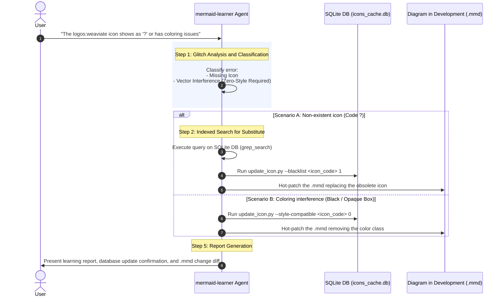

# Permanent Auto-Adaptive Learning Loop Rule

This directive establishes the formal and immutable protocol that the `mermaid-learner` subagent must follow autonomously to register icon rendering errors, update knowledge databases, and hot-patch diagrams, ensuring adaptive immunity against visual glitches.

---

## 1. The 5-Step Learning Protocol

When the user reports an icon rendering glitch (e.g., "the logos:weaviate icon is not visible" or "icon X has a black block around it"), the agent **MUST** execute the following sequence without requiring manual design confirmation:

---

## 2. Protocol Steps Detail

### Step 1: Interception and Classification of the Glitch
Analyze the reported symptom to classify the error into one of these two categories:
*   **Type A (Missing Icon / `?`):** The icon code is not found in Mermaid's active libraries or has been renamed/deprecated.
*   **Type B (Contrast Glitch / Black Box):** The icon renders, but appears distorted, covered by the node's background color, or inside a solid block due to the CSS injection of an inappropriate class.

### Step 2: Finding a Viable Alternative (For Type A)
Using exclusively the authorized native command tool `python3 [path/to/]skills/mermaid-designer/scripts/query_icons.py --batch "<term>"` or `grep_search` over local databases, the agent must perform queries for similar keywords (e.g., if Weaviate fails, search for "vector database" or "pinecone"). **It is strictly forbidden** to run manual SQLite SQL queries with `python3 -c "import sqlite3; ..."` from the terminal, or to use unsupported/help flags.

### Step 3: Updating Plugin Knowledge Assets (SQLite Cache)
The agent must execute the database updater CLI to set appropriate status flags:
*   **Type A:** Run the update CLI to blacklist the deprecated/missing icon code:
    `python3 [path/to/]skills/mermaid-designer/scripts/update_icon.py --blacklist <icon_code> 1`
*   **Type B:** Run the update CLI to set the style compatibility of the icon to 0:
    `python3 [path/to/]skills/mermaid-designer/scripts/update_icon.py --style-compatible <icon_code> 0`

### Step 4: Hot-Patching the Diagram (.mmd)
The agent opens the affected `.mmd` file and applies the exact corrective measure (replaces the icon with the substitute, or removes the background color class from the node).

### Step 5: Professional Report
Present a confirmation to the user detailing:
1.  The executed SQL update parameters via `update_icon.py` on `icons_cache.db`.
2.  Why this technical decision was made.
3.  A **Git Diff** block showing exactly the changes made to the source diagram `.mmd` file.
